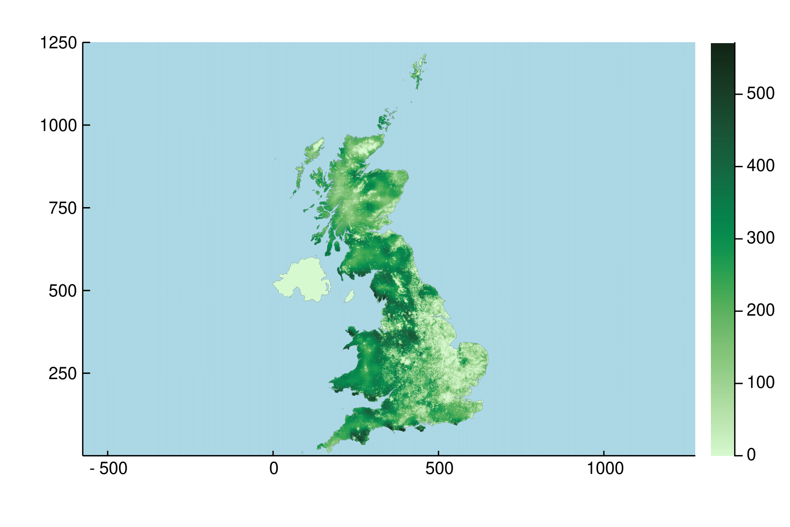

# UKplantSim #

| **Documentation** | **Build Status** | **DOI** |
|:-----------------:|:----------------:|:-------:|
|  | [![build tests][actions-img]][actions-url]  |  |
|  | [![codecov][codecov-img]][codecov-url] |  |

## Julia repository to run UK level plant dynamics using EcoSISTEM ##

This package extends and updates EcoSISTEM to run plant simulations on a 1km grid for the UK. It incorporates data on land cover, climate and soils. We are currently in beta, so please report any problems by raising an issue.

[actions-img]: https://github.com/boydorr/UKplantSim.jl/actions/workflows/testing.yaml/badge.svg
[actions-url]: https://github.com/boydorr/UKplantSim.jl/actions

[codecov-img]: https://codecov.io/gh/boydorr/UKplantSim.jl/branch/main/graph/badge.svg?token=M62CXNJPIP
[codecov-url]: https://codecov.io/gh/boydorr/UKplantSim.jl?branch=main
